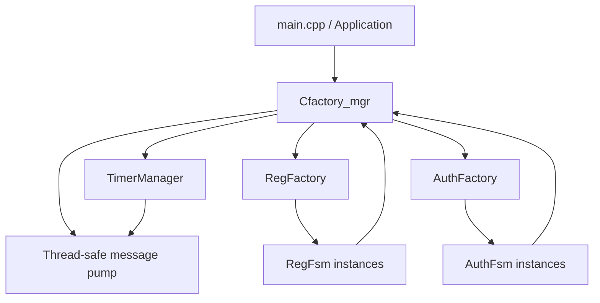
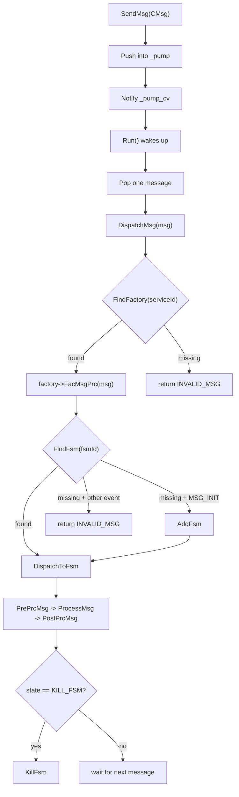
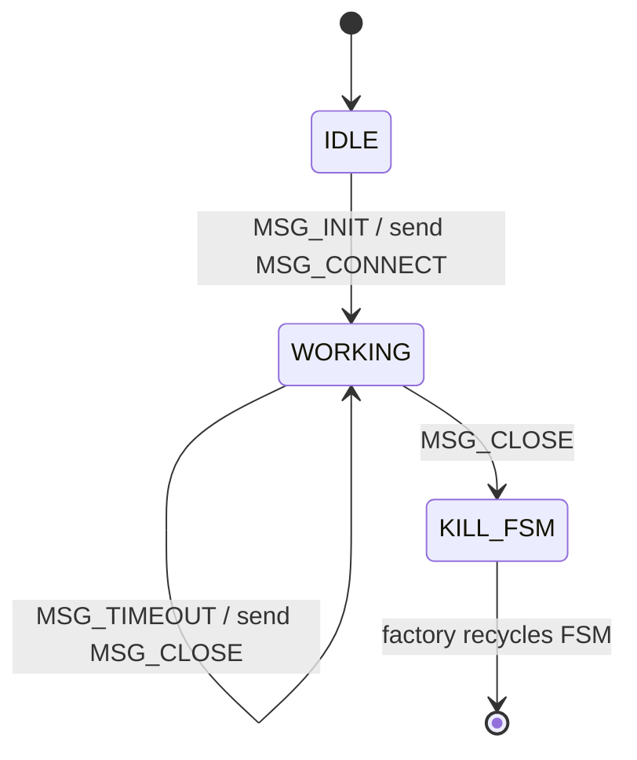

# FsmFramework 设计文档

[English version](design_en.md)

本文档说明当前 `FsmFramework` 的实现状态、核心架构、模块职责、运行流程、测试入口和后续演进方向。

## 1. 项目概述

`FsmFramework` 是一个 C++11 事件驱动有限状态机框架原型。当前代码采用 `Cfactory_mgr -> Cfactory -> Cfsm` 三层结构：

- `Cfactory_mgr` 是顶层管理器，负责工厂注册、消息泵、消息分发、后台线程和定时器入口。
- `Cfactory` 是 FSM 工厂基类，负责创建、查找、派发和回收 FSM。
- `Cfsm` 是 FSM 基类，负责状态、生命周期钩子、消息暂存队列，以及低耦合消息/定时器投递接口。

当前示例实现了两条业务流程：

- `FAC_REG_FAC_ID -> RegFactory -> RegFsm`
- `FAC_AUTH_FAC_ID -> AuthFactory -> AuthFsm`

## 2. 目录结构

```text
FsmFramework/
├── CMakeLists.txt
├── README.md
├── README_en.md
├── docs/
│   ├── design.md
│   └── design_en.md
├── reg_fsm/
│   ├── main.cpp
│   ├── inc/
│   │   ├── AuthFactory.h
│   │   ├── AuthFsm.h
│   │   ├── CMsg.h
│   │   ├── Cfactory.h
│   │   ├── Cfactory_mgr.h
│   │   ├── Cfsm.h
│   │   ├── FsmTableExecutor.h
│   │   ├── RegFactory.h
│   │   ├── RegFsm.h
│   │   ├── TimerManager.h
│   │   └── common.h
│   └── src/
│       ├── AuthFactory.cpp
│       ├── AuthFsm.cpp
│       ├── CMsg.cpp
│       ├── Cfactory.cpp
│       ├── Cfactory_mgr.cpp
│       ├── Cfsm.cpp
│       ├── RegFactory.cpp
│       ├── RegFsm.cpp
│       └── TimerManager.cpp
└── tests/
    └── framework_tests.cpp
```

核心代码位于 `reg_fsm` 目录；`tests/framework_tests.cpp` 覆盖基础行为、主链路和压力测试；`docs/design.md` 是默认中文设计文档。

## 3. 核心类型

### 3.1 消息

`CMsg` 是统一消息对象。

```cpp
class CMsg
{
public:
    MsgType type = MSG_INIT;
    unsigned int serviceId = 0;
    unsigned int fsmId = 0;
    unsigned int sessionId = 0;
    std::vector<char> msg;
};
```

| 字段 | 说明 |
|---|---|
| `type` | 当前事件类型，用于查找 FSM 转移规则。 |
| `serviceId` | 目标工厂 ID，由 `Cfactory_mgr` 用于路由。 |
| `fsmId` | 目标 FSM 实例 ID；为 `0` 时可由工厂按规则创建新 FSM。 |
| `sessionId` | 业务会话 ID，预留给上层协议或流程跟踪。 |
| `msg` | 消息载荷，当前 demo 尚未深度使用。 |

### 3.2 事件

```cpp
enum MsgType
{
    MSG_INIT,
    MSG_CONNECT,
    MSG_REQ,
    MSG_RESP,
    MSG_TIMEOUT,
    MSG_CLOSE
};
```

| 事件 | 说明 |
|---|---|
| `MSG_INIT` | 初始化业务流程。 |
| `MSG_CONNECT` | 准备或建立连接。 |
| `MSG_REQ` | 发送或处理请求。 |
| `MSG_RESP` | 处理响应。 |
| `MSG_TIMEOUT` | 处理超时流程。 |
| `MSG_CLOSE` | 关闭流程并结束 FSM。 |

### 3.3 状态

```cpp
enum Tstate
{
    IDLE = 0,
    WORKING,
    KILL_FSM
};
```

| 状态 | 说明 |
|---|---|
| `IDLE` | FSM 已创建，尚未进入业务处理。 |
| `WORKING` | FSM 正在处理业务流程。 |
| `KILL_FSM` | FSM 生命周期结束，等待工厂回收。 |

### 3.4 错误码

```cpp
enum EerrNo
{
    INIT = 0,
    SUCCESS,
    ERROR,
    INVALID_STATE,
    INVALID_MSG,
    TIMER_ERROR,
};
```

| 错误码 | 说明 |
|---|---|
| `INIT` | 初始或尚未处理。 |
| `SUCCESS` | 处理成功。 |
| `ERROR` | 通用失败。 |
| `INVALID_STATE` | 当前状态不允许该操作。 |
| `INVALID_MSG` | 当前状态下消息非法，或路由目标不存在。 |
| `TIMER_ERROR` | 定时器操作失败。 |

## 4. 架构和职责

### 4.1 `Cfactory_mgr`

`Cfactory_mgr` 是顶层入口，主要职责如下：

1. 使用 `std::unique_ptr<Cfactory>` 持有并管理多个工厂。
2. 使用线程安全队列 `_pump` 接收外部消息、FSM 自投递消息和定时器消息。
3. 使用 `SendMsg` 入队并唤醒消息泵。
4. 使用 `Run`/`Start` 在后台线程中持续分发消息。
5. 使用 `PumpOnce`/`RunUntilEmpty` 支持测试或单线程驱动。
6. 按 `serviceId` 查找工厂并调用 `FacMsgPrc`。
7. 通过 `TimerManager` 提供 `StartTimer`、`StopTimer`、`StopAllTimers`。
8. `Stop` 后拒绝新消息，并在队列排空后退出运行循环。

### 4.2 `Cfactory`

`Cfactory` 是 FSM 工厂基类。当前版本已经把通用路由逻辑放入基类，具体工厂通常只需要实现 `CreateFsm()`。

主要职责：

1. 保存工厂 ID，并与 `CMsg::serviceId` 对应。
2. 使用 `std::unique_ptr<Cfsm>` 持有 FSM 实例。
3. 使用 `_fsm_lock` 保护 FSM 列表和自增 `_nextFsmId`。
4. 在 `MSG_INIT` 且未找到 FSM 时创建新 FSM。
5. 在非 `MSG_INIT` 且未找到 FSM 时返回 `INVALID_MSG`。
6. 调用 `PrePrcMsg`、`ProcessMsg`、`PostPrcMsg` 完成派发。
7. 在 FSM 进入 `KILL_FSM` 后调用 `KillFsm` 回收。

### 4.3 `Cfsm`

`Cfsm` 是状态机基类，保存 `fsmId`、当前状态、处理结果、所属工厂指针、保存队列和挂起队列。

关键接口：

| 接口 | 说明 |
|---|---|
| `GetState` / `SetState` | 获取或设置当前状态；`SetState` 会触发进入/退出钩子。 |
| `PrePrcMsg` | 消息前处理钩子。 |
| `ProcessMsg` | 消息主处理逻辑。 |
| `PostPrcMsg` | 消息后处理钩子。 |
| `Create` / `Destroy` | FSM 初始化和清理。 |
| `SendMsg` | 通过所属工厂的 manager 投递消息。 |
| `StartTimer` / `StopTimer` | 通过 manager 操作定时器。 |
| `SaveMsg` / `HoldMsg` | 保存或挂起暂时不能处理的消息。 |

`PrePrcMsg`、`ProcessMsg`、`PostPrcMsg` 声明为纯虚函数，但基类仍提供默认实现。这让 `Cfsm` 保持抽象，同时允许派生 FSM 显式复用基类行为。

### 4.4 `FsmTableExecutor`

`FsmTableExecutor.h` 是表驱动状态机的通用执行辅助：

1. `FindFsmTransition` 按 `当前状态 + 当前事件` 查找转移项。
2. `ExecuteFsmTransition` 先拒绝 `KILL_FSM` 状态。
3. 调用基类 `Cfsm::ProcessMsg` 作为公共处理入口。
4. 未找到合法转移时返回 `INVALID_MSG`。
5. 找到转移后执行日志、业务 action、状态切换和下一事件投递。

### 4.5 `TimerManager`

`TimerManager` 已从 `Cfactory_mgr` 中拆出，负责定时器线程和回调投递。当前实现仍是原型方案：每个 timer 创建一个线程，线程 `sleep_for(timeoutMs)` 后检查 `active`，若仍有效则通过回调投递消息。

限制：

- 定时器数量很多时会创建大量线程。
- `StopTimer` 只会阻止到期后投递消息，不会中断 `sleep_for`。
- `StopAndJoin` 需要等待已启动的 timer 线程结束。

### 4.6 `RegFsm` 和 `AuthFsm`

`RegFsm` 和 `AuthFsm` 都继承自 `Cfsm`，使用自己的转移表描述业务流程。每个转移项包含：

- 起始状态 `from`
- 触发事件 `event`
- 目标状态 `to`
- 是否生成后续事件 `hasNext`
- 后续事件 `nextEvent`
- 定时延迟 `delayMs`
- 日志文本 `log`
- 业务动作函数指针 `action`

## 5. 运行流程

### 5.1 总体架构



### 5.2 消息分发



### 5.3 注册流程

| 当前事件 | 状态变化 | 后续事件 |
|---|---|---|
| `MSG_INIT` | `IDLE -> WORKING` | `MSG_CONNECT` |
| `MSG_CONNECT` | `WORKING -> WORKING` | `MSG_REQ` |
| `MSG_REQ` | `WORKING -> WORKING` | `MSG_RESP` |
| `MSG_RESP` | `WORKING -> WORKING` | `MSG_TIMEOUT` after 10 ms |
| `MSG_TIMEOUT` | `WORKING -> WORKING` | `MSG_CLOSE` |
| `MSG_CLOSE` | `WORKING -> KILL_FSM` | none |



### 5.4 认证流程

| 当前事件 | 状态变化 | 后续事件 |
|---|---|---|
| `MSG_INIT` | `IDLE -> WORKING` | `MSG_CONNECT` |
| `MSG_CONNECT` | `WORKING -> WORKING` | `MSG_REQ` |
| `MSG_REQ` | `WORKING -> WORKING` | `MSG_RESP` |
| `MSG_RESP` | `WORKING -> WORKING` | `MSG_CLOSE` after 100 ms |
| `MSG_CLOSE` | `WORKING -> KILL_FSM` | none |


## 6. 构建和运行

项目根目录提供 `CMakeLists.txt`，当前 target：

- `reg_fsm_demo`：示例程序。
- `reg_fsm_tests`：基础测试和压力测试程序。

```bash
cmake -S . -B build
cmake --build build
./build/reg_fsm_demo
cmake --build build --target test
```

Windows Debug 构建下可执行文件通常位于：

```bash
./build/Debug/reg_fsm_demo.exe
./build/Debug/reg_fsm_tests.exe
```

## 7. 测试覆盖

当前 `tests/framework_tests.cpp` 覆盖：

1. `CMsg` 默认字段。
2. `RegFsm` 在 `IDLE` 下处理非法事件时返回 `INVALID_MSG`。
3. `AuthFsm` 在 `IDLE` 下处理非法事件时返回 `INVALID_MSG`。
4. `Cfactory_mgr -> Cfactory -> Cfsm` 主链路 smoke test。
5. 单生产者消息派发压力测试。
6. 注册/认证真实流程观察。
7. 多 FSM 路由压力测试。
8. 多生产者并发 `SendMsg` 压力测试。

注意：当前压力测试使用 `PERF_MSG_COUNT = 10000000`，适合观察吞吐，但不适合每次快速迭代都完整运行。

## 8. 当前限制

| 限制 | 说明 |
|---|---|
| 日志仍直接使用 `std::cout` | 没有统一级别、模块、时间戳或开关。 |
| `TimerManager` 仍是一个 timer 一个线程的原型实现 | 定时器数量很多时会创建大量线程。 |
| `StopTimer` 不会中断 `sleep_for` | 只会阻止到期后投递。 |
| `SaveMsg` / `HoldMsg` 还没有完整调度策略 | 当前已有队列接口，但没有恢复策略。 |
| 消息载荷尚未封装 | `std::vector<char>` 还没有协议读写和资源池。 |
| 测试仍使用 `assert` | 尚未接入 GoogleTest 等单元测试框架。 |

## 9. 推荐演进方向

建议按风险和收益优先级继续推进：

1. 抽象统一日志接口，至少支持模块名、错误码和开关。
2. 将 `TimerManager` 升级为单 worker + 条件变量 + 优先队列，避免大量 timer 线程。
3. 把 `FsmTableExecutor` 扩展为更完整的转移执行器，进一步减少业务 FSM 重复代码。
4. 引入 GoogleTest 或其他测试框架，并拆分压力测试与普通单元测试。
5. 为 `SaveMsg` / `HoldMsg` 定义明确调度语义。
6. 为 `CMsg::msg` 增加 payload 读写接口或消息缓冲区池。
7. 基于转移表生成 Mermaid 或 DOT 状态图。

## 10. 新增业务 FSM 的步骤

以新增 `LoginFsm` 为例：

1. 在 `common.h` 中新增 factory ID，例如 `FAC_LOGIN_FAC_ID`。
2. 新增 `LoginFsm.h/.cpp`，继承 `Cfsm`。
3. 新增 `LoginFactory.h/.cpp`，继承 `Cfactory` 并实现 `CreateFsm()`。
4. 在 `LoginFsm` 中定义转移表、业务 action、`PostNextEvent`。
5. 复用 `ExecuteFsmTransition` 实现 `ProcessMsg`。
6. 在 `main.cpp` 或应用入口中注册 `LoginFactory`。
7. 在 `CMakeLists.txt` 中加入新增源文件。
8. 在测试中补充合法流程和非法转移用例。

## 11. 总结

当前项目已经具备一个可运行、可测试、可扩展的 FSM 框架雏形。相比早期 demo，最新实现已经补齐了通用工厂路由、统一转移表执行辅助、独立定时器管理器、细分错误码、后台消息泵和压力测试入口。后续重点可以放在日志、定时器实现、测试框架、payload 管理和状态图导出上。
