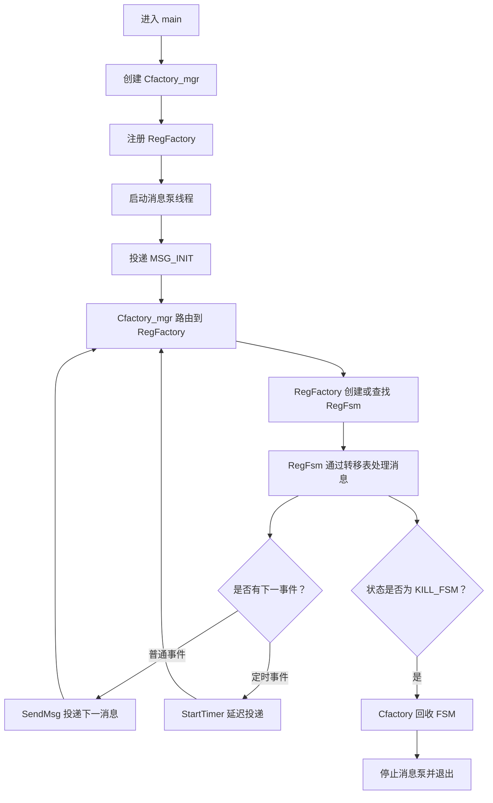
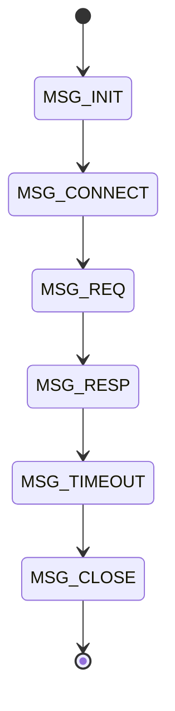
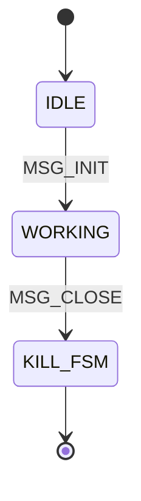
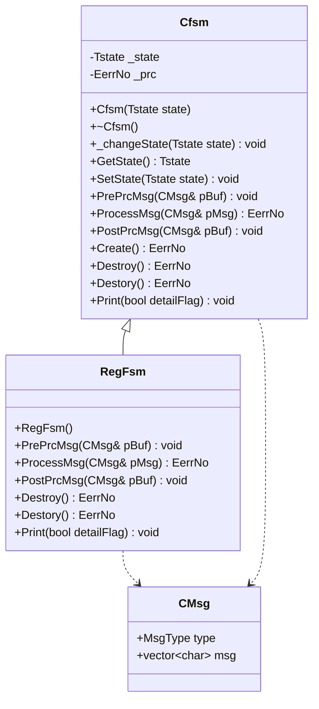
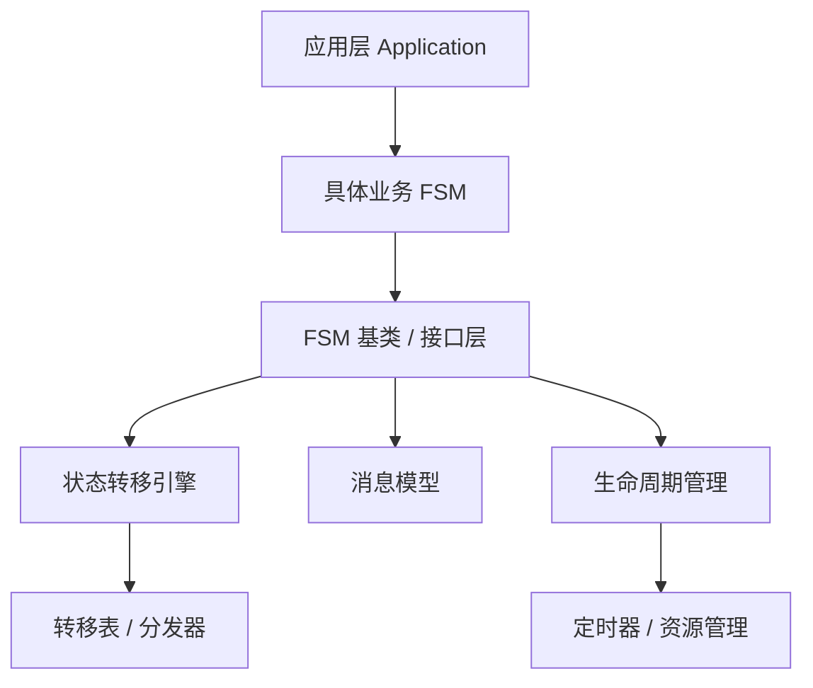

# FsmFramework 设计文档

## 1. 文档目的

本文档用于说明 `FsmFramework` 项目的当前代码结构、核心设计思路、状态机运行流程、主要类职责、接口约定、当前限制以及后续演进方向。

当前项目规模较小，但已经具备一个有限状态机框架的基本雏形：

- 有统一的状态机基类；
- 有独立的消息对象；
- 有具体业务状态机实现；
- 有示例入口演示完整消息推进流程。

本文档既描述“现在代码是怎么工作的”，也给出“后续如果要把它变成更通用框架，可以怎么演进”的建议。

## 2. 项目概述

`FsmFramework` 是一个 C++ 事件驱动有限状态机框架原型。当前实现的是一个类似“注册服务”的状态机流程，并已经具备 `Cfactory_mgr -> Cfactory -> Cfsm` 三层调度结构。

示例流程从 `MSG_INIT` 开始，依次经过连接、请求、响应、超时、关闭等步骤，最终进入 `KILL_FSM` 状态并由工厂回收 FSM 实例。

当前核心代码位于 `reg_fsm` 目录：

```text
FsmFramework/
├── README.md
└── reg_fsm/
    ├── main.cpp
    ├── inc/
    │   ├── CMsg.h
    │   ├── Cfactory.h
    │   ├── Cfactory_mgr.h
    │   ├── Cfsm.h
    │   ├── RegFactory.h
    │   ├── RegFsm.h
    │   └── common.h
    └── src/
        ├── CMsg.cpp
        ├── Cfactory.cpp
        ├── Cfactory_mgr.cpp
        ├── Cfsm.cpp
        ├── RegFactory.cpp
        └── RegFsm.cpp
tests/
└── framework_tests.cpp
```

## 3. 设计目标

当前代码体现出的设计目标可以概括为：

1. 提供一个可复用的状态机基类 `Cfsm`。
2. 通过继承方式扩展不同业务状态机。
3. 用统一消息对象 `CMsg` 驱动状态机处理。
4. 将消息处理拆分为前处理、处理中、后处理三个阶段。
5. 让具体状态机自行定义消息到消息、消息到状态的转移逻辑。

## 4. 非目标

当前版本已经实现了状态机工厂、管理器、线程安全消息泵、定时器事件、CMake 构建入口和基础测试入口。

暂未完整实现的能力包括：

1. 完整日志系统。
2. 真实消息缓冲区资源池。
3. 状态进入和退出回调。
4. 大规模压测与性能指标。
5. 基于 GoogleTest 等测试框架的系统化单元测试。
6. 定时器线程的条件变量唤醒优化。

## 5. 核心概念

### 5.1 状态机

状态机负责维护当前状态，并根据输入消息执行业务逻辑，然后决定是否改变状态或生成下一条消息。

当前项目中：

- 抽象状态机由 `Cfsm` 表示；
- 注册流程状态机由 `RegFsm` 表示。

### 5.2 状态

状态由 `Tstate` 枚举表示，定义在 `reg_fsm/inc/common.h`。

```cpp
enum Tstate
{
    IDLE = 0,
    WORKING,
    KILL_FSM
};
```

状态含义：

| 状态 | 含义 |
|---|---|
| `IDLE` | 状态机已创建，尚未进入业务处理流程。 |
| `WORKING` | 状态机正在执行注册业务流程。 |
| `KILL_FSM` | 状态机生命周期结束，外部循环应停止继续调用。 |

### 5.3 消息

消息由 `CMsg` 类表示，定义在 `reg_fsm/inc/CMsg.h`。

```cpp
class CMsg
{
public:
    MsgType type = MSG_INIT;
    unsigned int serviceId = 0;
    unsigned int fsmId = 0;
    unsigned int sessionId = 0;
    std::vector<char> msg;
};
```

当前字段说明：

| 字段 | 类型 | 说明 |
|---|---|---|
| `type` | `MsgType` | 当前消息类型。默认值是 `MSG_INIT`。 |
| `serviceId` | `unsigned int` | 目标服务或工厂 ID，用于路由到 `Cfactory`。 |
| `fsmId` | `unsigned int` | 目标 FSM 实例 ID，用于路由到具体 `Cfsm`。 |
| `sessionId` | `unsigned int` | 业务会话 ID，预留给业务层使用。 |
| `msg` | `std::vector<char>` | 消息载荷，当前示例中暂未使用。 |

当前流程主要依赖 `type` 驱动。`msg` 字段可以为后续协议数据、业务参数、请求体或响应体预留。

### 5.4 消息类型

消息类型由 `MsgType` 枚举表示。

```cpp
enum MsgType
{
    MSG_INIT,
    MSG_CONNECT,
    MSG_REQ,
    MSG_RESP,
    MSG_TIMEOUT,
    MSG_CLOSE
};
```

消息含义：

| 消息 | 含义 |
|---|---|
| `MSG_INIT` | 初始化注册流程。 |
| `MSG_CONNECT` | 建立连接或准备连接。 |
| `MSG_REQ` | 发送或处理请求。 |
| `MSG_RESP` | 处理响应。 |
| `MSG_TIMEOUT` | 处理超时流程。 |
| `MSG_CLOSE` | 关闭流程并结束状态机。 |

### 5.5 处理结果

处理结果由 `EerrNo` 表示，定义在 `common.h`。

```cpp
enum EerrNo
{
    INIT = 0,
    SUCCESS,
    ERROR,
};
```

含义：

| 枚举值 | 含义 |
|---|---|
| `INIT` | 初始状态或尚未处理。 |
| `SUCCESS` | 处理成功。 |
| `ERROR` | 处理失败。 |

## 6. 模块职责

### 6.1 `common.h`

`common.h` 负责放置公共类型和常量定义。

当前内容包括：

- 基础类型别名，例如 `U32`；
- 服务相关宏，例如 `CHAT_SERVICE_KEY_BASE`、`MAX_CHAT_SERVICE_KEY`；
- 消息类型枚举 `Tmsg_type`；
- 状态枚举 `Tstate`；
- 错误码枚举 `EerrNo`。

注意：当前 `Tmsg_type`、`CHAT_SERVICE_KEY_BASE`、`MAX_CHAT_SERVICE_KEY` 等定义在示例流程中还没有实际使用。

### 6.2 `CMsg`

`CMsg` 是消息载体，负责承载状态机处理所需的输入信息。

当前设计很简单：

- 默认消息类型为 `MSG_INIT`；
- 保留 `std::vector<char>` 类型的消息体。

它目前没有成员函数，也没有做封装校验。后续如果消息结构复杂，可以增加以下能力：

- 构造函数；
- 消息类型检查；
- payload 读写接口；
- 序列化和反序列化；
- 消息来源、目标、序列号、时间戳等元数据。

### 6.3 `Cfsm`

`Cfsm` 是状态机基类，定义在 `reg_fsm/inc/Cfsm.h`，实现在 `reg_fsm/src/Cfsm.cpp`。

核心成员：

```cpp
private:
    unsigned int _fsmId;
    Tstate _state;
    EerrNo _prc;
    Cfactory* _factory;

protected:
    std::list<CMsg> _save;
    std::list<CMsg> _hold;
```

成员含义：

| 成员 | 含义 |
|---|---|
| `_fsmId` | 当前 FSM 在工厂中的实例 ID。 |
| `_state` | 当前状态机状态。 |
| `_prc` | 最近一次处理结果。 |
| `_factory` | 所属工厂指针，用于访问管理器和投递后续消息。 |
| `_save` | 暂存消息队列。 |
| `_hold` | 挂起消息队列。 |

核心接口：

| 接口 | 说明 |
|---|---|
| `GetState()` | 获取当前状态。 |
| `SetState(Tstate state)` | 设置当前状态。 |
| `_changeState(Tstate state)` | 内部状态切换接口。 |
| `PrePrcMsg(CMsg& pBuf)` | 消息处理前置阶段。 |
| `ProcessMsg(CMsg& pMsg)` | 消息处理主阶段。 |
| `PostPrcMsg(CMsg& pBuf)` | 消息处理后置阶段。 |
| `Create()` | 状态机创建初始化。 |
| `Destroy()` | 状态机销毁处理。 |
| `Destory()` | 兼容旧代码的销毁接口包装。 |
| `SaveMsg()` / `HoldMsg()` | 保存或挂起消息。 |
| `Print(bool detailFlag)` | 打印状态机信息。 |

当前实现特点：

- 构造函数只初始化基础字段，`Cfactory::AddFsm()` 创建实例后调用 `Create()`；
- `Create()` 将 `_prc` 设置为 `INIT`；
- `ProcessMsg()` 默认打印 `"Cfsm::ProcessMsg"` 并返回 `SUCCESS`；
- `PrePrcMsg()`、`PostPrcMsg()` 默认打印对应日志。

### 6.4 `RegFsm`

`RegFsm` 是具体业务状态机，定义在 `reg_fsm/inc/RegFsm.h`，实现在 `reg_fsm/src/RegFsm.cpp`。

它继承自 `Cfsm`：

```cpp
class RegFsm : public Cfsm
```

主要职责：

1. 实现注册服务相关流程。
2. 根据当前 `CMsg::type` 决定下一步。
3. 在合适时机修改状态机状态。
4. 复用基类的前处理、主处理和后处理默认逻辑。

当前 `RegFsm::ProcessMsg` 使用表驱动方式处理消息类型：

```cpp
struct RegTransition
{
    Tstate from;
    MsgType event;
    Tstate to;
    bool hasNext;
    MsgType nextEvent;
    unsigned int delayMs;
    const char* log;
};
```

## 7. 状态转移设计

### 7.1 消息推进表

当前注册流程中，消息按照固定顺序推进：

| 当前消息 | 处理行为 | 下一消息 |
|---|---|---|
| `MSG_INIT` | 初始化注册服务 | `MSG_CONNECT` |
| `MSG_CONNECT` | 处理连接阶段 | `MSG_REQ` |
| `MSG_REQ` | 处理请求阶段 | `MSG_RESP` |
| `MSG_RESP` | 处理响应阶段 | `MSG_TIMEOUT` |
| `MSG_TIMEOUT` | 处理超时阶段 | `MSG_CLOSE` |
| `MSG_CLOSE` | 关闭注册服务 | 不再设置下一消息 |

### 7.2 状态变化表

当前状态变化比较简单：

| 当前状态 | 触发消息 | 下一状态 |
|---|---|---|
| `IDLE` | `MSG_INIT` | `WORKING` |
| `WORKING` | `MSG_CONNECT` | `WORKING` |
| `WORKING` | `MSG_REQ` | `WORKING` |
| `WORKING` | `MSG_RESP` | `WORKING` |
| `WORKING` | `MSG_TIMEOUT` | `WORKING` |
| `WORKING` | `MSG_CLOSE` | `KILL_FSM` |

### 7.3 当前实现中的关键点

`RegFsm::ProcessMsg` 的关键逻辑是：

1. 如果当前状态已经是 `KILL_FSM`，返回 `ERROR`，避免重复处理。
2. 调用基类 `Cfsm::ProcessMsg(pMsg)`。
3. 根据“当前状态 + 当前消息”查找 `RegTransition` 转移表。
4. 找不到合法转移时返回 `ERROR`。
5. 找到转移后打印日志并切换到目标状态。
6. 如果转移表配置了下一事件，则通过 `Cfactory_mgr::SendMsg` 或 `Cfactory_mgr::StartTimer` 投递。
7. 在 `MSG_CLOSE` 时设置状态为 `KILL_FSM`，随后由 `Cfactory` 回收该 FSM。

这意味着当前状态机不再直接修改同一个 `CMsg::type` 来驱动流程，而是通过管理器消息泵投递下一条消息。普通事件和定时器事件走同一条分发链路。

## 8. 运行流程

### 8.1 主流程

`main.cpp` 中的 `FsmTest1()` 是当前 demo 流程。

伪代码如下：

```cpp
void FsmTest1()
{
    Cfactory_mgr mgr;
    mgr.RegisterFactory(new RegFactory(1));

    mgr.Start();

    CMsg pMsg;
    pMsg.serviceId = 1;
    pMsg.type = MSG_INIT;
    mgr.SendMsg(pMsg);

    std::this_thread::sleep_for(std::chrono::milliseconds(100));
    mgr.Stop();
    mgr.Join();
}
```

### 8.2 流程图



### 8.3 消息流



### 8.4 状态流



## 9. 类关系



## 10. 接口设计说明

### 10.1 `PrePrcMsg`

前处理接口。

当前行为：

- `RegFsm::PrePrcMsg` 调用 `Cfsm::PrePrcMsg`；
- 基类打印 `"Cfsm::PrePrcMsg"`。

适合放置的逻辑：

- 消息合法性预检查；
- 上下文准备；
- 日志记录；
- 统计计数；
- 消息解码。

### 10.2 `ProcessMsg`

主处理接口。

当前行为：

- `RegFsm::ProcessMsg` 先检查当前状态；
- 调用 `Cfsm::ProcessMsg`；
- 根据 `CMsg::type` 执行转移；
- 返回 `SUCCESS` 或 `ERROR`。

适合放置的逻辑：

- 核心业务处理；
- 状态转移；
- 生成下一步事件；
- 错误处理；
- 调用外部服务或协议处理函数。

### 10.3 `PostPrcMsg`

后处理接口。

当前行为：

- `RegFsm::PostPrcMsg` 调用 `Cfsm::PostPrcMsg`；
- 基类打印 `"Cfsm::PostPrcMsg"`。

适合放置的逻辑：

- 释放临时资源；
- 记录处理结果；
- 发送处理完成通知；
- 上报统计信息；
- 清理消息缓存。

### 10.4 `Create`

状态机初始化接口。

当前行为：

- 设置 `_state = IDLE`；
- 设置 `_prc = INIT`；
- 返回 `SUCCESS`。

后续可以扩展：

- 初始化状态机上下文；
- 注册定时器；
- 分配资源；
- 初始化内部队列。

### 10.5 `Destroy`

状态机销毁接口。

当前行为：

- 打印 `"Cfsm::Destroy"`；
- 返回 `SUCCESS`。

注意：当前代码保留了 `Destory()` 作为旧接口兼容包装，新的代码应优先调用 `Destroy()`。

后续可以扩展：

- 停止定时器；
- 释放资源；
- 关闭连接；
- 清空队列；
- 输出最终状态。

## 11. 当前代码中的设计问题

### 11.1 构造函数初始化策略

`Cfsm` 构造函数签名是：

```cpp
explicit Cfsm(Tstate state = IDLE);
```

当前实现会在构造函数初始化列表中使用传入的 `state`：

```cpp
Cfsm::Cfsm(Tstate state)
    : _fsmId(0), _state(state), _prc(EerrNo::INIT), _factory(nullptr)
{
}
```

`Create()` 不再重置 `_state`，只负责初始化处理结果等生命周期字段。这样可以避免构造阶段和工厂创建阶段重复初始化状态。

### 11.2 纯虚函数提供默认实现

`Cfsm.h` 中这几个接口被声明为纯虚函数：

```cpp
virtual void PrePrcMsg(CMsg& pBuf) = 0;
virtual EerrNo ProcessMsg(CMsg& pMsg) = 0;
virtual void PostPrcMsg(CMsg& pBuf) = 0;
```

但 `Cfsm.cpp` 又提供了实现。

这在 C++ 中是允许的，含义是：

- `Cfsm` 仍然是抽象类，不能直接实例化；
- 派生类必须实现这些函数；
- 派生类可以在自己的实现中显式调用基类版本，例如 `Cfsm::ProcessMsg(pMsg)`。

如果这是有意设计，建议在注释中说明。否则容易让维护者困惑。

### 11.3 `Destory` 兼容问题

旧接口名是 `Destory`，正确英文通常应为 `Destroy`。当前代码已经新增 `Destroy()`，并保留 `Destory()` 作为兼容包装。

影响：

- 影响可读性；
- 后续其他开发者容易写错；
- 文档和代码会持续传播这个拼写。

建议尽早统一修正。

### 11.4 输入消息和下一消息混用

当前 `ProcessMsg` 会直接修改 `pMsg.type`：

```cpp
pMsg.type = MSG_CONNECT;
```

这让流程很简单，但也带来一个问题：同一个字段既表示“当前输入事件”，又表示“下一轮要处理的事件”。

当流程变复杂后，可能会出现以下问题：

- 调试时不容易知道原始输入是什么；
- 错误处理时无法保留失败消息；
- 多事件队列场景下不容易扩展；
- 状态机变成自驱动模式，而不是外部事件驱动模式。

### 11.5 状态和消息没有强约束

当前 `RegFsm` 只根据消息类型分支，没有严格检查当前状态是否允许处理该消息。

例如理论上可以在 `IDLE` 状态下处理 `MSG_RESP`，当前代码并不会阻止。

如果后续要作为通用框架，应增加“当前状态 + 当前消息”的联合校验。

### 11.6 日志没有统一格式

当前日志直接使用 `std::cout` 输出，且部分输出没有换行。

例如：

```cpp
std::cout << "[MSG_INIT]: start reg service";
```

这会导致多条日志连在同一行。

建议至少统一加 `std::endl` 或 `'\n'`。如果项目扩大，可以引入轻量日志封装。

### 11.7 构建系统已补充

项目当前已经新增根目录 `CMakeLists.txt`，可以构建 demo 和测试入口。

后续仍可继续增强：

- 增加更多编译选项；
- 增加安装规则；
- 接入 CI；
- 按库和示例程序拆分 target。

## 12. 推荐演进方案

### 12.1 第一阶段：整理当前代码

目标是让当前 demo 更规范，但不改变整体设计。

建议事项：

1. 持续完善 `CMakeLists.txt`。
2. 优先使用 `Destroy`，逐步清理旧的 `Destory` 兼容接口。
3. 修正构造函数初始状态参数不生效的问题。
4. 给日志补充换行。
5. 清理未使用宏或补充注释说明。
6. 在 README 中增加构建和运行说明。

### 12.2 第二阶段：增强可测试性

目标是让状态转移可以被自动验证。

建议事项：

1. 增加单元测试。
2. 将状态转移逻辑拆成更小函数。
3. 避免 `ProcessMsg` 直接承担太多职责。
4. 为非法消息和非法状态增加测试。

可测试点：

- `CMsg` 默认类型是 `MSG_INIT`；
- `RegFsm` 初始状态是 `IDLE`；
- `MSG_INIT` 后状态变成 `WORKING`；
- 完整流程最终进入 `KILL_FSM`；
- 非法消息返回 `ERROR`。

### 12.3 第三阶段：引入显式转移结果

当前接口返回 `EerrNo`，下一消息通过修改 `CMsg` 获得。

可以考虑新增结果类型：

```cpp
struct FsmResult
{
    EerrNo err;
    Tstate nextState;
    MsgType nextMsg;
};
```

这样可以明确表达：

- 本次处理是否成功；
- 下一状态是什么；
- 是否产生下一事件。

### 12.4 第四阶段：表驱动状态机

当前 `RegFsm` 已经从 `switch` 演进为表驱动。后续如果流程继续变多，可以把转移表进一步抽象到基类或配置层。

示例结构：

```cpp
struct Transition
{
    Tstate currentState;
    MsgType event;
    Tstate nextState;
    MsgType nextEvent;
};
```

优点：

- 状态转移规则更集中；
- 更容易检查缺失分支；
- 更容易做自动化测试；
- 可以在配置文件或表中描述流程。

### 12.5 第五阶段：框架化能力

如果项目要发展成真正的 FSM 框架，可以继续增加：

1. 状态机基类模板化。
2. 状态机工厂。
3. 状态机实例管理器。
4. 事件队列。
5. 定时器管理。
6. 状态进入和退出回调。
7. 统一日志接口。
8. 统一错误处理策略。
9. DOT/Mermaid 状态图导出。

## 13. 建议的目标架构

如果后续要从 demo 演进为框架，可以参考以下分层：



各层职责：

| 层级 | 职责 |
|---|---|
| 应用层 | 创建状态机，投递消息，接收处理结果。 |
| 具体业务 FSM | 实现业务动作和状态转移规则。 |
| FSM 基类 / 接口层 | 统一生命周期和处理接口。 |
| 状态转移引擎 | 负责根据状态和事件找到下一步。 |
| 消息模型 | 定义消息类型、载荷和元数据。 |
| 生命周期管理 | 管理创建、销毁、资源释放。 |

## 14. 扩展示例：新增一个状态机

如果要新增一个业务状态机，例如 `LoginFsm`，可以按当前模式执行：

1. 在 `inc` 下新增 `LoginFsm.h`。
2. 在 `src` 下新增 `LoginFsm.cpp`。
3. 继承 `Cfsm`。
4. 实现 `PrePrcMsg`、`ProcessMsg`、`PostPrcMsg`。
5. 在 `ProcessMsg` 中定义自己的消息转移。

示例结构：

```cpp
class LoginFsm : public Cfsm
{
public:
    explicit LoginFsm();

    void PrePrcMsg(CMsg& pBuf) override;
    EerrNo ProcessMsg(CMsg& pMsg) override;
    void PostPrcMsg(CMsg& pBuf) override;
};
```

这种方式简单直接，适合小规模状态机。若状态机数量变多，则建议引入统一注册和工厂机制。

## 15. 错误处理建议

当前错误处理只有 `ERROR`，粒度较粗。后续可以考虑细分错误码：

```cpp
enum EerrNo
{
    INIT = 0,
    SUCCESS,
    ERROR,
    INVALID_STATE,
    INVALID_MSG,
    TIMEOUT,
    INTERNAL_ERROR
};
```

这样可以区分：

- 消息非法；
- 状态非法；
- 处理超时；
- 内部错误；
- 外部依赖失败。

## 16. 日志建议

短期建议：

- 每条日志统一换行；
- 日志中包含状态、消息、处理结果；
- 错误日志中包含失败原因。

示例：

```text
[RegFsm] state=IDLE event=MSG_INIT result=SUCCESS next_state=WORKING next_event=MSG_CONNECT
```

长期建议：

- 封装日志宏；
- 支持日志级别；
- 支持输出文件名和行号；
- 支持关闭或打开调试日志。

## 17. 构建建议

建议添加根目录 `CMakeLists.txt`。

一个可能的目标划分：

```text
reg_fsm_lib      状态机库
reg_fsm_demo     示例程序
reg_fsm_tests    单元测试
```

这样项目可以通过统一命令构建：

```bash
cmake -S . -B build
cmake --build build
```

## 18. 测试建议

建议增加以下测试用例：

| 测试项 | 预期 |
|---|---|
| 创建 `CMsg` | 默认 `type` 为 `MSG_INIT` |
| 创建 `RegFsm` | 默认状态为 `IDLE` |
| 处理 `MSG_INIT` | 状态变为 `WORKING`，消息变为 `MSG_CONNECT` |
| 完整循环处理 | 最终状态为 `KILL_FSM` |
| 非法消息 | 返回 `ERROR` |
| `MSG_CLOSE` | 状态变为 `KILL_FSM` |

如果暂时不引入测试框架，也可以先写一个简单的断言版 demo。

## 19. 当前示例预期输出

当前示例大致处理顺序如下：

```text
Cfsm::PrePrcMsg
Cfsm::ProcessMsg
[MSG_INIT]: start reg service
Cfsm::ProcessMsg
[MSG_CONNECT]: start reg service
Cfsm::ProcessMsg
[MSG_REQ]: start reg service
Cfsm::ProcessMsg
[MSG_RESP]: start reg service
Cfsm::ProcessMsg
[MSG_TIMEOUT]: start reg service
Cfsm::ProcessMsg
[MSG_CLOSE]: start reg service
Cfsm::PostPrcMsg
Cfsm::Destroy
```

由于当前部分 `std::cout` 没有输出换行，实际控制台中可能不是每条日志独占一行。

## 20. 总结

`FsmFramework` 当前是一个精简的有限状态机原型。它已经具备以下基础：

- 抽象状态机基类；
- 具体业务状态机；
- 消息驱动处理；
- 状态推进；
- 简单生命周期接口。

当前最值得优先处理的问题是：

1. 增加构建系统；
2. 逐步清理 `Destory` 兼容接口；
3. 明确构造函数初始状态语义；
4. 补充测试；
5. 统一日志输出格式；
6. 继续增强状态转移表的通用性。

如果项目目标只是学习状态机，当前结构已经足够直观。如果目标是做可复用框架，建议下一步从构建系统、测试和状态转移模型这三件事开始推进。

## 21. 当前框架实现进展

当前代码已经在原始 demo 基础上实现了第一版框架化改造，核心能力包括：

1. `Cfactory_mgr` 作为顶层管理器，负责工厂注册、消息泵、消息分发、停止控制和定时器事件。
2. `Cfactory` 作为状态机工厂基类，负责 FSM 创建、查找、消息派发和生命周期回收。
3. `RegFactory` 作为注册业务工厂，负责把注册类消息路由到 `RegFsm`。
4. `Cfsm` 作为状态机基类，维护 `fsmId`、状态、所属工厂、`_save` 和 `_hold` 消息暂存队列。
5. `RegFsm` 已从 `switch` 分支改造成表驱动状态转移。
6. `MSG_RESP -> MSG_TIMEOUT` 已通过 `Cfactory_mgr::StartTimer` 定时器事件触发。
7. `main.cpp` 已改为通过 `Cfactory_mgr` 投递初始消息，由后台消息泵驱动完整流程。
8. 项目新增 `CMakeLists.txt` 和 `tests/framework_tests.cpp`，用于构建 demo 和基础测试。
9. `Cfactory_mgr` 已新增 `Start/Stop/Join`，调用方不需要分散管理工作线程。
10. `Cfsm` 已新增受保护的 `SendMsg/StartTimer/StopTimer`，业务 FSM 不再直接依赖 manager。
11. `Cfactory` 已为 FSM 列表增加锁保护，降低并发访问风险。
12. `Cfsm::SetState` 已支持 `OnExitState/OnEnterState` 状态切换钩子。

当前运行链路如下：

```text
main
  -> Cfactory_mgr::RegisterFactory
  -> Cfactory_mgr::Start
  -> Cfactory_mgr::Run
  -> Cfactory_mgr::SendMsg(MSG_INIT)
  -> RegFactory::FacMsgPrc
  -> Cfactory::AddFsm
  -> RegFsm::ProcessMsg
  -> Cfsm::SendMsg / StartTimer
  -> MSG_CLOSE 后 Cfactory::KillFsm
```

## 22. 后续可继续增强的方向

虽然当前版本已经具备框架雏形，但如果要进一步提升简历竞争力和工程完整度，建议继续补充：

1. 更细粒度错误码，例如 `INVALID_STATE`、`INVALID_MSG`、`TIMER_ERROR`。
2. `Cfactory` 内部 FSM 列表的并发保护。
3. 定时器线程的条件变量唤醒机制，避免长时间 sleep 阻塞析构等待。
4. 更完整的单元测试框架，例如 GoogleTest。
5. 压测用例，例如大量 FSM 实例和大量消息投递。
6. 消息缓冲区池 `Cmsgbuf`，替代直接拷贝 `std::vector<char>`。
7. 状态进入和退出回调，例如 `OnEnterState`、`OnExitState`。
8. 状态图导出能力，用转移表生成 Mermaid 或 DOT。
