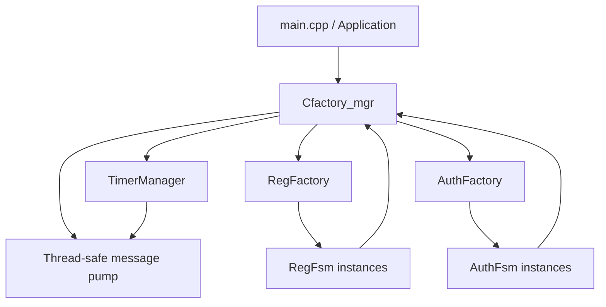
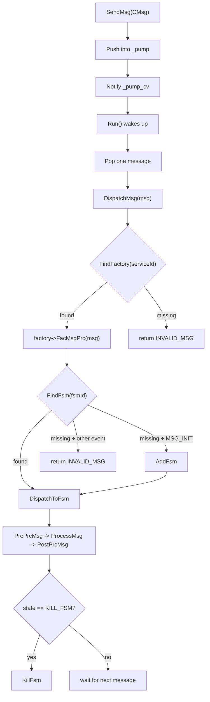
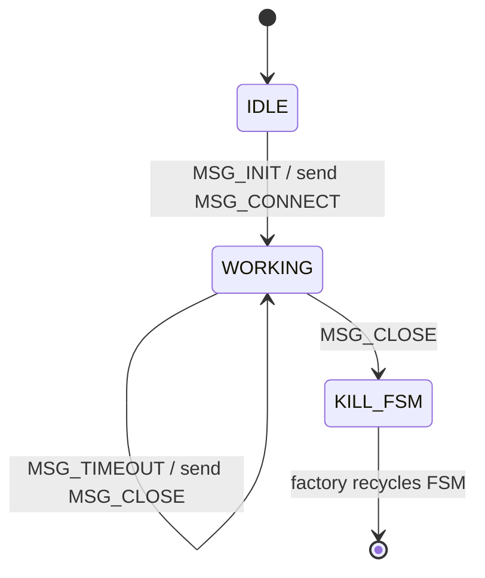

# FsmFramework Design Document

[中文版本](design.md)

This document describes the current implementation, core architecture, module responsibilities, runtime flow, test entry points, and future evolution of `FsmFramework`.

## 1. Overview

`FsmFramework` is a C++11 event-driven finite state machine framework prototype. The current code is organized as a three-layer `Cfactory_mgr -> Cfactory -> Cfsm` architecture:

- `Cfactory_mgr` is the top-level manager. It owns factory registration, the message pump, message dispatch, the worker thread, and timer entry points.
- `Cfactory` is the base FSM factory. It creates, finds, dispatches to, and reclaims FSM instances.
- `Cfsm` is the base FSM class. It stores state, lifecycle hooks, deferred message queues, and low-coupling helpers for messages and timers.

The current demo includes two business flows:

- `FAC_REG_FAC_ID -> RegFactory -> RegFsm`
- `FAC_AUTH_FAC_ID -> AuthFactory -> AuthFsm`

## 2. Repository Layout

```text
FsmFramework/
├── CMakeLists.txt
├── README.md
├── README_en.md
├── docs/
│   ├── design.md
│   └── design_en.md
├── reg_fsm/
│   ├── main.cpp
│   ├── inc/
│   │   ├── AuthFactory.h
│   │   ├── AuthFsm.h
│   │   ├── CMsg.h
│   │   ├── Cfactory.h
│   │   ├── Cfactory_mgr.h
│   │   ├── Cfsm.h
│   │   ├── FsmTableExecutor.h
│   │   ├── RegFactory.h
│   │   ├── RegFsm.h
│   │   ├── TimerManager.h
│   │   └── common.h
│   └── src/
│       ├── AuthFactory.cpp
│       ├── AuthFsm.cpp
│       ├── CMsg.cpp
│       ├── Cfactory.cpp
│       ├── Cfactory_mgr.cpp
│       ├── Cfsm.cpp
│       ├── RegFactory.cpp
│       ├── RegFsm.cpp
│       └── TimerManager.cpp
└── tests/
    └── framework_tests.cpp
```

Core code lives under `reg_fsm`; `tests/framework_tests.cpp` covers basic behavior, the main dispatch path, and stress tests; `docs/design_en.md` is the English design document.

## 3. Core Types

### 3.1 Message

`CMsg` is the unified message object.

```cpp
class CMsg
{
public:
    MsgType type = MSG_INIT;
    unsigned int serviceId = 0;
    unsigned int fsmId = 0;
    unsigned int sessionId = 0;
    std::vector<char> msg;
};
```

| Field | Description |
|---|---|
| `type` | Current event type used to find an FSM transition rule. |
| `serviceId` | Target factory ID used by `Cfactory_mgr` for routing. |
| `fsmId` | Target FSM instance ID; `0` may create a new FSM by factory rules. |
| `sessionId` | Business session ID reserved for upper-layer protocols or workflow tracking. |
| `msg` | Message payload; not heavily used by the current demo. |

### 3.2 Events

```cpp
enum MsgType
{
    MSG_INIT,
    MSG_CONNECT,
    MSG_REQ,
    MSG_RESP,
    MSG_TIMEOUT,
    MSG_CLOSE
};
```

| Event | Description |
|---|---|
| `MSG_INIT` | Initialize a business flow. |
| `MSG_CONNECT` | Prepare or establish a connection. |
| `MSG_REQ` | Send or process a request. |
| `MSG_RESP` | Process a response. |
| `MSG_TIMEOUT` | Process a timeout path. |
| `MSG_CLOSE` | Close the flow and finish the FSM. |

### 3.3 States

```cpp
enum Tstate
{
    IDLE = 0,
    WORKING,
    KILL_FSM
};
```

| State | Description |
|---|---|
| `IDLE` | The FSM is created but has not entered business processing. |
| `WORKING` | The FSM is processing the business flow. |
| `KILL_FSM` | The FSM is finished and is waiting for factory cleanup. |

### 3.4 Error Codes

```cpp
enum EerrNo
{
    INIT = 0,
    SUCCESS,
    ERROR,
    INVALID_STATE,
    INVALID_MSG,
    TIMER_ERROR,
};
```

| Code | Description |
|---|---|
| `INIT` | Initial or not yet processed. |
| `SUCCESS` | Processing succeeded. |
| `ERROR` | General failure. |
| `INVALID_STATE` | The current state does not allow the operation. |
| `INVALID_MSG` | The message is invalid for the current state, or the routing target does not exist. |
| `TIMER_ERROR` | Timer operation failed. |

## 4. Architecture and Responsibilities

### 4.1 `Cfactory_mgr`

`Cfactory_mgr` is the top-level entry point. Its responsibilities are:

1. Own multiple factories through `std::unique_ptr<Cfactory>`.
2. Use the thread-safe `_pump` queue for external messages, FSM-generated messages, and timer messages.
3. Enqueue messages with `SendMsg` and wake the message pump.
4. Dispatch messages continuously in a background thread through `Run`/`Start`.
5. Support tests or single-threaded driving through `PumpOnce`/`RunUntilEmpty`.
6. Find factories by `serviceId` and call `FacMsgPrc`.
7. Provide `StartTimer`, `StopTimer`, and `StopAllTimers` through `TimerManager`.
8. Reject new messages after `Stop`, then exit the loop after the queue is drained.

### 4.2 `Cfactory`

`Cfactory` is the base FSM factory. The current version keeps common routing logic in the base class, so concrete factories usually only need to implement `CreateFsm()`.

Responsibilities:

1. Store the factory ID that matches `CMsg::serviceId`.
2. Own FSM instances through `std::unique_ptr<Cfsm>`.
3. Protect the FSM list and `_nextFsmId` with `_fsm_lock`.
4. Create a new FSM when the message is `MSG_INIT` and no existing FSM is found.
5. Return `INVALID_MSG` when a non-`MSG_INIT` message targets a missing FSM.
6. Dispatch through `PrePrcMsg`, `ProcessMsg`, and `PostPrcMsg`.
7. Reclaim an FSM with `KillFsm` after it enters `KILL_FSM`.

### 4.3 `Cfsm`

`Cfsm` is the base FSM class. It stores `fsmId`, current state, processing result, owner factory pointer, saved messages, and held messages.

Key APIs:

| API | Description |
|---|---|
| `GetState` / `SetState` | Get or set state; `SetState` triggers enter/exit hooks. |
| `PrePrcMsg` | Message pre-processing hook. |
| `ProcessMsg` | Main message processing logic. |
| `PostPrcMsg` | Message post-processing hook. |
| `Create` / `Destroy` | FSM initialization and cleanup. |
| `SendMsg` | Post a message through the owning factory's manager. |
| `StartTimer` / `StopTimer` | Operate timers through the manager. |
| `SaveMsg` / `HoldMsg` | Save or hold messages that cannot be processed immediately. |

`PrePrcMsg`, `ProcessMsg`, and `PostPrcMsg` are declared as pure virtual functions but also have default base implementations. This keeps `Cfsm` abstract while allowing derived FSMs to explicitly reuse base behavior.

### 4.4 `FsmTableExecutor`

`FsmTableExecutor.h` is the shared helper for table-driven FSM execution:

1. `FindFsmTransition` finds a transition by `current state + current event`.
2. `ExecuteFsmTransition` rejects `KILL_FSM` first.
3. It calls base `Cfsm::ProcessMsg` as the common processing entry.
4. It returns `INVALID_MSG` when no valid transition is found.
5. On success, it logs, runs the business action, changes state, and posts the next event if configured.

### 4.5 `TimerManager`

`TimerManager` has been extracted from `Cfactory_mgr`. It owns timer threads and posts messages through a callback. The current implementation is still a prototype: each timer creates one thread, sleeps for `timeoutMs`, checks `active`, and posts the message if still active.

Limitations:

- Many timers create many threads.
- `StopTimer` only prevents message posting after expiration; it does not interrupt `sleep_for`.
- `StopAndJoin` must wait for already-started timer threads to finish.

### 4.6 `RegFsm` and `AuthFsm`

`RegFsm` and `AuthFsm` both derive from `Cfsm` and describe their business flows with transition tables. Each transition contains:

- source state `from`
- event `event`
- target state `to`
- whether it posts a follow-up event `hasNext`
- follow-up event `nextEvent`
- timer delay `delayMs`
- log text `log`
- business action pointer `action`

## 5. Runtime Flow

### 5.1 High-Level Architecture



### 5.2 Message Dispatch



### 5.3 Registration Flow

| Current Event | State Change | Next Event |
|---|---|---|
| `MSG_INIT` | `IDLE -> WORKING` | `MSG_CONNECT` |
| `MSG_CONNECT` | `WORKING -> WORKING` | `MSG_REQ` |
| `MSG_REQ` | `WORKING -> WORKING` | `MSG_RESP` |
| `MSG_RESP` | `WORKING -> WORKING` | `MSG_TIMEOUT` after 10 ms |
| `MSG_TIMEOUT` | `WORKING -> WORKING` | `MSG_CLOSE` |
| `MSG_CLOSE` | `WORKING -> KILL_FSM` | none |



### 5.4 Authentication Flow

| Current Event | State Change | Next Event |
|---|---|---|
| `MSG_INIT` | `IDLE -> WORKING` | `MSG_CONNECT` |
| `MSG_CONNECT` | `WORKING -> WORKING` | `MSG_REQ` |
| `MSG_REQ` | `WORKING -> WORKING` | `MSG_RESP` |
| `MSG_RESP` | `WORKING -> WORKING` | `MSG_CLOSE` after 100 ms |
| `MSG_CLOSE` | `WORKING -> KILL_FSM` | none |


## 6. Build and Run

The root `CMakeLists.txt` defines two targets:

- `reg_fsm_demo`: demo executable.
- `reg_fsm_tests`: basic and stress test executable.

```bash
cmake -S . -B build
cmake --build build
./build/reg_fsm_demo
cmake --build build --target test
```

On Windows Debug builds, executables are commonly located at:

```bash
./build/Debug/reg_fsm_demo.exe
./build/Debug/reg_fsm_tests.exe
```

## 7. Test Coverage

`tests/framework_tests.cpp` currently covers:

1. Default `CMsg` fields.
2. `RegFsm` returning `INVALID_MSG` for an invalid event in `IDLE`.
3. `AuthFsm` returning `INVALID_MSG` for an invalid event in `IDLE`.
4. A smoke test for the `Cfactory_mgr -> Cfactory -> Cfsm` pipeline.
5. Single-producer message dispatch stress test.
6. Real registration/authentication flow observation.
7. Multi-FSM routing stress test.
8. Multi-producer concurrent `SendMsg` stress test.

Note: the current stress tests use `PERF_MSG_COUNT = 10000000`. This is useful for throughput observation, but not ideal for every quick development iteration.

## 8. Current Limitations

| Limitation | Description |
|---|---|
| Logging still uses `std::cout` directly | No unified levels, modules, timestamps, or switches. |
| `TimerManager` is still a one-thread-per-timer prototype | Many timers create many threads. |
| `StopTimer` does not interrupt `sleep_for` | It only prevents posting after expiration. |
| `SaveMsg` / `HoldMsg` do not yet have a full scheduling policy | Queue helpers exist, but no resume policy is defined yet. |
| The message payload is not wrapped | `std::vector<char>` does not yet have protocol helpers or a resource pool. |
| Tests still use `assert` | No GoogleTest-style unit test framework is integrated yet. |

## 9. Recommended Evolution

Recommended next steps, ordered by risk and payoff:

1. Add a unified logging interface with at least module names, error codes, and switches.
2. Upgrade `TimerManager` to a single worker with a condition variable and priority queue to avoid many timer threads.
3. Extend `FsmTableExecutor` into a fuller transition executor to reduce repeated business FSM code.
4. Introduce GoogleTest or another test framework, and split stress tests from normal unit tests.
5. Define explicit scheduling semantics for `SaveMsg` / `HoldMsg`.
6. Add payload helpers or a message buffer pool for `CMsg::msg`.
7. Generate Mermaid or DOT state diagrams from transition tables.

## 10. Adding a New Business FSM

For example, to add `LoginFsm`:

1. Add a new factory ID in `common.h`, such as `FAC_LOGIN_FAC_ID`.
2. Add `LoginFsm.h/.cpp` and derive it from `Cfsm`.
3. Add `LoginFactory.h/.cpp`, derive it from `Cfactory`, and implement `CreateFsm()`.
4. Define the transition table, business actions, and `PostNextEvent` in `LoginFsm`.
5. Reuse `ExecuteFsmTransition` to implement `ProcessMsg`.
6. Register `LoginFactory` in `main.cpp` or the application entry point.
7. Add the new source files to `CMakeLists.txt`.
8. Add tests for both the valid flow and invalid transitions.

## 11. Summary

The project now has a runnable, testable, and extensible FSM framework shape. Compared with the early demo, the latest implementation includes common factory routing, a shared transition table executor, a standalone timer manager, more specific error codes, a background message pump, and stress test entry points. The next valuable improvements are logging, timer internals, a test framework, payload management, and state diagram generation.
